# 09-Surfs_up
Module 9: Surf's Up with Advanced Data Storage and Retrieval

## Project Overview
We've been tasked to create a Weather Analysis from a SQLite Weather Data in Oahu, Hawaii, to back up a business plan to open a Surf&Shake Shop.

## Resources
- Python 3.7.6, Anaconda 4.8.3, Jupyter Notebook, Pandas, Numpy, SQLalchemy, SQLite
- hawaii.sqlite

## Summary
- we started by doing a weather analysis on 1 full year (2016-8-23 - 2017-8-23). We can see that some months have higher amount of precipitation than others. 75% of measurements are lower than the mean, which is still relatively low - it doesn't rain much, except for some strong showers. 

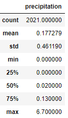 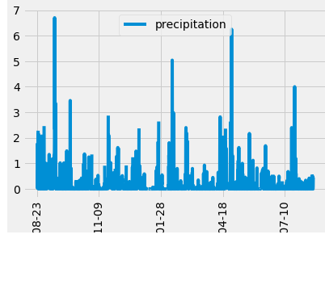 

- from the most active station, we got the histogram of temperatures for one year showing that the temperature remains mostly between 67° and 80° - with 325 days over 67°.
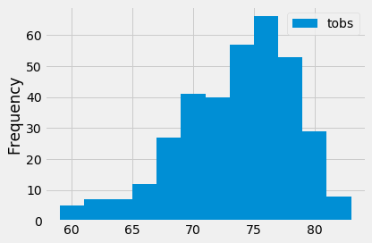

- we built a Flask app that returns
     
     - all the precipiation data for the same full year - precipitation route
     
     - the different stations providing the data - station route
     
     - all the temperatures observed at the most active station during the same year - tobs route
     
     - the key statistics (min, avg, max) temperatures between 2 dates - temp route
      
## Challenge Overview
Getting the key statistics for the weather data for the months of June and December across all the stations.

## Challenge Summary

Using the SQLite "extract" method, we could filter through all the data by month, get the key statistics, then create box-and-whisker plots to easily compare both.

- 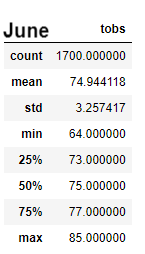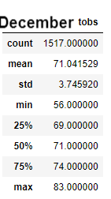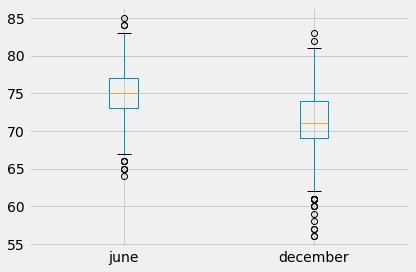

Not suprisingly, we can see that the weather temperatures are pleasant in both June and December, with both means between 70° and 75°, and the temperature in Decembner generally lower by 3-5°. There are very few outliers in this 7-year-range data. We notice more cold outliers in December - that may happen at night. 

- 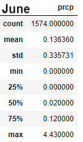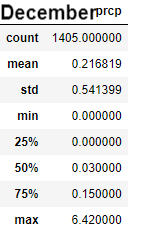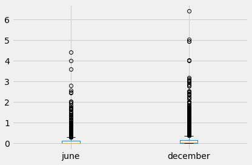 

As we saw looking at the precipitation data during a full year, 75% of the measurements are also lower than the mean in both cases. The mean for December is almost twice as high as the mean for June, even if both are relatively low - it definitely rains more in December. There a lot of outliers with both maximums at around 30 times the mean - showing a nice weather prone to short intense showers. These showers happen more often and get more intense in December. It may still look like a Surf & Shake weather in both months - we can shelter in the icecream shop during the shower.

- We added a "month" route  - @app.route("/api/v1.0/<nm>") "nm" being the month's number -to the Flask app that gives the key statistics (min-avg-max temperature and precipitaion) for a chosen month      

**Recommendations for further analysis**: we need to look more closely at the precipitations outliers.
- geographically by getting the precipitation key statistics for each station in June and December:
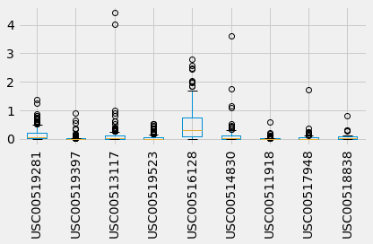 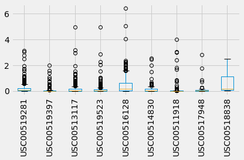 

Each station is following the same trend in June and December, with more rain in the latter. The 5th station definitely gets more rain than all the other stations, and several high outliers in both months. Stations 2, 4, and 7, may experience a bit less rain generally than the other ones. But for each of them, we may need to look more deeply into the outliers.

- get key statistics for the outliers, and look for patterns, comparing their date & time stamp:

               - are they close in time? This could make a difference between short showers and longer rain time
               - what time are they mostly happening? are they happening during the night or day? during business/surf hours?
             
- even if June and December are the highest seasons, get the key statistics for the other months, for all the stations, by station, then for the outliers      
               
               
               

